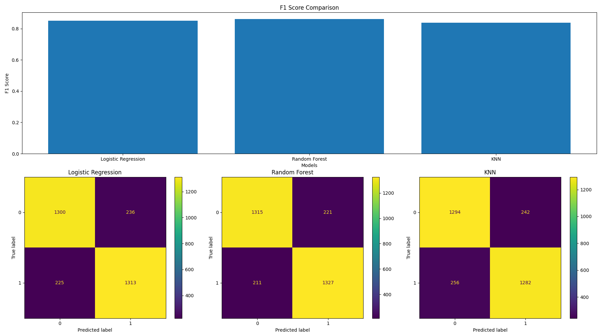

# Screen Time & Productivity Classification using Machine Learning

This project classifies individuals into **high productivity** or **low productivity** groups using screen time, sleep, exercise, phone usage, and study/work habit data. It was developed as a college project for **CS106: Basics of Machine Learning & Applications**.

The project combines a custom survey dataset with a Kaggle screen time dataset, applies a full preprocessing pipeline, trains multiple machine learning models, compares their performance, and generates visual outputs for model evaluation.

## Project Objective

The goal is to predict whether a person is likely to have high or low productivity based on behavioral and lifestyle features such as:

- Daily screen time
- Social media usage
- Phone pickups per day
- Phone usage before sleep
- Sleep duration
- Exercise frequency
- Study/work hours
- Age group and occupation

The original productivity score is converted into a binary label using the dataset median:

- `1` = high productivity
- `0` = low productivity

## Dataset

Two datasets are used:

| File | Description |
| --- | --- |
| `cleaned_form.csv` | Custom survey dataset collected for the project |
| `kaggle_screentime.csv` | Public Kaggle screen time dataset |

The datasets are standardized into a common schema and merged using `pandas.concat`. For the Kaggle data, productivity is derived from mental fatigue using:

```python
productivity_score = 10 - mental_fatigue_score
```

## Features Used

| Feature | Type | Description |
| --- | --- | --- |
| `age_group` | Categorical | Respondent age group |
| `daily_screentime` | Numeric | Total daily screen time in hours |
| `social_media_hours` | Numeric | Daily social media usage |
| `phone_pickups` | Numeric | Number of phone pickups per day |
| `phone_before_sleep` | Categorical | Whether the phone is used before sleeping |
| `sleep_hours` | Numeric | Average sleep duration |
| `exercise_freq` | Categorical | Regular exercise habit |
| `study_work_hours` | Numeric | Weekly study or work hours |

## Machine Learning Pipeline

The implementation follows a complete supervised learning workflow:

1. Load survey and Kaggle datasets
2. Rename columns into a unified schema
3. Encode categorical columns using `LabelEncoder`
4. Convert numeric columns with `pd.to_numeric`
5. Drop rows with missing productivity scores
6. Create a binary productivity label using the median score
7. Split data into 80% training and 20% testing using stratification
8. Fill missing values with `KNNImputer`
9. Balance the training data using `SMOTE`
10. Scale features using `StandardScaler`
11. Tune models with 5-fold `GridSearchCV`
12. Evaluate models using Accuracy, F1-score, AUC-ROC, and confusion matrices

## Models Compared

Three classification models are trained and compared:

| Model | Hyperparameters Tuned |
| --- | --- |
| Logistic Regression | `C`, `solver` |
| Random Forest | `n_estimators`, `max_depth` |
| K-Nearest Neighbors | `n_neighbors`, `weights` |

Grid search uses F1-score as the selection metric.

## Results

| Metric | Logistic Regression | Random Forest | KNN |
| --- | ---: | ---: | ---: |
| Accuracy | 0.8500 | **0.8595** | 0.8377 |
| F1-Score | 0.8507 | **0.8600** | 0.8370 |
| AUC-ROC | 0.9317 | **0.9366** | 0.9133 |

Best hyperparameters:

| Model | Best Parameters |
| --- | --- |
| Logistic Regression | `C=1`, `solver=liblinear` |
| Random Forest | `n_estimators=100`, `max_depth=10` |
| KNN | `n_neighbors=7`, `weights=uniform` |

Random Forest performed best overall, achieving the highest Accuracy, F1-score, and AUC-ROC.

## Confusion Matrix Summary

| Model | True Low | False High | False Low | True High |
| --- | ---: | ---: | ---: | ---: |
| Logistic Regression | 1300 | 236 | 225 | 1313 |
| Random Forest | 1315 | 221 | 211 | 1327 |
| KNN | 1294 | 242 | 257 | 1282 |

## Output Visualization

The script generates `model_output.png`, which includes:

- F1-score comparison across all models
- Confusion matrix for each model



## Files

| File | Description |
| --- | --- |
| `screen_time_productivity_classifier.py` | Main Python script containing preprocessing, model training, evaluation, and visualization |
| `cleaned_form.csv` | Custom survey dataset |
| `kaggle_screentime.csv` | Kaggle dataset |
| `model_output.png` | Generated model comparison and confusion matrix output |

## How to Run

Install the required Python libraries:

```powershell
pip install pandas numpy scikit-learn imbalanced-learn matplotlib
```

Run the project:

```powershell
python screen_time_productivity_classifier.py
```

After execution, the output visualization is saved as:

```text
model_output.png
```

## Key Learnings

- Median thresholding converts productivity score into a balanced binary classification problem.
- KNN imputation handles missing values caused by merging datasets with different feature sets.
- SMOTE helps balance the training data without duplicating existing rows.
- GridSearchCV improves model selection by tuning hyperparameters through cross-validation.
- AUC-ROC gives useful threshold-independent insight beyond accuracy and F1-score.

## Conclusion

This project demonstrates a complete machine learning workflow for productivity classification using behavioral screen time and lifestyle data. Among the tested models, **Random Forest** achieved the best overall performance, suggesting that non-linear feature interactions are important for predicting productivity from screen time, sleep, exercise, and phone usage patterns.

Future improvements could include feature importance analysis, testing XGBoost or LightGBM, expanding the survey dataset, and building an interactive Streamlit app for live productivity prediction.

